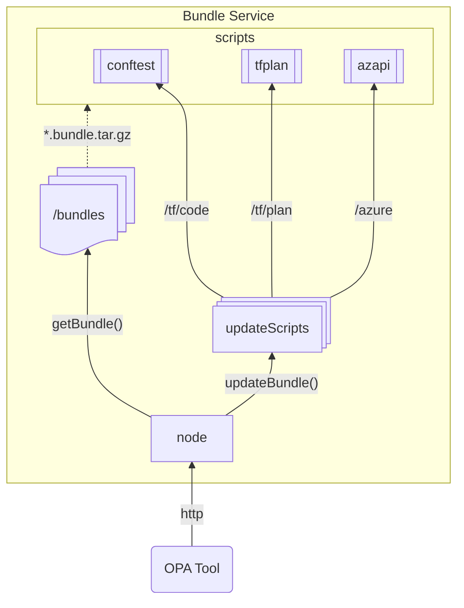

# OPA Bundle Service

This is an example repository for a OPA bundle provider.

## Usage

**For one-shot testing individual bundles:**
1. Build the required bundles:
   ```sh
   > opa build -b <bundle_dir> -o <bundle_name>.tar.gz
   ```
2. Evaluate your script:
   ```sh
   > opa eval -b <bundle_name>.tar.gz <rego_pkg>.rego "data.<rego_pkg>"
   ``` 

**For running the bundle server:**
1. Start the server:
   ```sh
   > opa build -b <bundle_dir> -o /bundles/<bundle_name>.tar.gz
   ```
2. Start the server:
   ```sh
   > cd server && yarn start
   ```
3. Copy the `samples/config/opa-config-template.yaml` and edit as necessary
4. Run OPA:
   ```sh
   > opa run -c <opa_config>.yaml <rego_pkg>.rego
   ```

## Architecture
